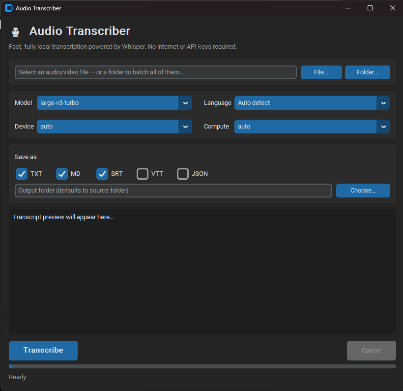

# 🦜 ParrotIA — Local Audio Transcriber

> Fast, free, fully local audio and video transcription powered by [Whisper](https://github.com/openai/whisper).  
> No internet connection, accounts, or API keys required — everything runs on your machine.




---

## Features

- **State-of-the-art models** — `tiny` → `large-v3`, plus the fast `large-v3-turbo` and `distil-large-v3` variants
- **Any language** — auto-detect, or pin a specific language for better accuracy
- **Multiple export formats** — `txt`, `md`, `srt`, `vtt`, `json` — pick any combination
- **CPU and GPU support** — auto-detects your hardware; gracefully falls back to CPU if the GPU is unavailable
- **Responsive UI** — transcription runs in a background thread with a live progress bar and a cancel button; the window never freezes
- **No ffmpeg needed** — audio is decoded via the bundled [PyAV](https://github.com/PyAV-Org/PyAV)
- **Headless CLI** — same engine, scriptable for batch jobs
- **Model benchmarking** — time several models on one file and compare their transcription speed (CLI)

---

## Requirements

- Python 3.9 or later
- pip

---

## Installation

```bash
pip install -r requirements.txt
```

The first time you use a model it is downloaded automatically (a few hundred MB to ~1.5 GB depending on the model) and cached for offline use afterwards.

### Optional: NVIDIA GPU acceleration

For much faster transcription on an NVIDIA GPU, install the CUDA 12 runtime wheels — no system-wide CUDA or cuDNN install required:

```bash
pip install nvidia-cublas-cu12 nvidia-cudnn-cu12 nvidia-cuda-runtime-cu12
```

The app discovers these automatically at startup. Set **Device → cuda** in the GUI (or pass `--device cuda` on the CLI). If the GPU is unavailable for any reason it falls back to CPU transparently.

---

## Usage

### GUI

```bash
python app.py
```

Or use the platform launcher (edit the `PYTHON` variable inside if needed):

| Platform | Launcher |
|----------|----------|
| Windows  | double-click `run.bat` |
| macOS / Linux | `chmod +x run.sh && ./run.sh` |

1. **Browse** to an audio or video file
2. Choose a **model**, **language**, **device**, and **output formats**
3. Click **Transcribe** — results are saved next to the source file (or in a folder you choose) and previewed in the window

### Command line

```bash
python cli.py "talk.mp3" --model large-v3-turbo --formats txt srt --language en
```

```
usage: cli.py [-h] [--model MODEL] [--language LANGUAGE] [--device DEVICE]
              [--compute COMPUTE] [--formats FORMAT [FORMAT ...]] [--outdir OUTDIR]
              audio

positional arguments:
  audio                 Path to the audio/video file

options:
  --model               Whisper model to use (default: large-v3-turbo)
  --language            Language code, e.g. en, pt (omit to auto-detect)
  --device              cpu | cuda | auto (default: auto)
  --compute             int8 | float16 | float32 | auto (default: auto)
  --formats             One or more output formats: txt md srt vtt json
  --outdir              Output folder (defaults to the source file's folder)
  --benchmark           Time several models on the file and print a speed
                        comparison instead of transcribing
  --models              Models to compare in --benchmark mode (default: all)
```

### Benchmarking model speed

Compare how fast different models transcribe the same file — useful for picking the best speed/accuracy trade-off for your hardware:

```bash
python cli.py "talk.mp3" --benchmark --models tiny base small large-v3-turbo
```

This loads and runs each model in turn, then prints a table reporting model **load** time, **decode** time, and **speed** — the real-time factor (seconds of audio transcribed per second of wall-clock time; higher is faster):

```
Model                 Audio     Load   Decode     Speed  Segments
-----------------------------------------------------------------
tiny                  78.8s     3.1s     6.6s      11.9x        26
base                  78.8s     9.4s     2.8s      28.0x        24
small                 78.8s     5.2s     7.1s      11.1x        25
large-v3-turbo        78.8s    12.0s     9.3s       8.5x        23

Fastest: base — 28.0x real-time (2.8s to decode 78.8s of audio)
```

Omit `--models` to benchmark every available model. The report is also written to `<file>.benchmark.txt` and `<file>.benchmark.json` next to the source (or in `--outdir`). Each model is loaded fresh so download/warm-up time is reflected honestly; a model that fails to run is recorded and the rest continue.

---

## Supported formats

| Format | Extension | Description |
|--------|-----------|-------------|
| `txt`  | `.txt`    | Plain transcript, one segment per line |
| `md`   | `.md`     | Markdown document with metadata header and timestamps |
| `srt`  | `.srt`    | SubRip subtitles |
| `vtt`  | `.vtt`    | WebVTT subtitles |
| `json` | `.json`   | Structured JSON with full metadata and per-segment timings |

---

## Model guide

| Model              | Speed    | Accuracy | Notes |
|--------------------|----------|----------|-------|
| `tiny` / `base`    | Fastest  | Lower    | Quick drafts, low-resource machines |
| `small` / `medium` | Balanced | Good     | Solid everyday choice |
| `large-v3`         | Slowest  | Best     | Highest accuracy |
| `large-v3-turbo`   | Fast     | Great    | **Recommended default** |
| `distil-large-v3`  | Fast     | Great    | English-focused, compact |

All models are free and run entirely on-device.

---

## Supported input formats

`.mp3` · `.wav` · `.m4a` · `.ogg` · `.opus` · `.flac` · `.aac` · `.wma` · `.mp4` · `.mkv` · `.mov` · `.avi` · `.webm`

---

## Project structure

| File | Purpose |
|------|---------|
| [`app.py`](app.py) | customtkinter GUI |
| [`transcriber.py`](transcriber.py) | Whisper engine (model cache, progress callbacks, cancellation, GPU fallback) |
| [`formats.py`](formats.py) | txt / md / srt / vtt / json writers |
| [`cli.py`](cli.py) | Headless command-line interface |
| [`benchmark.py`](benchmark.py) | Model speed benchmarking (CLI) |

---

## Contributing

Contributions are welcome! Feel free to open an issue or submit a pull request.

---

## License

[AGPL-3.0](LICENSE)
